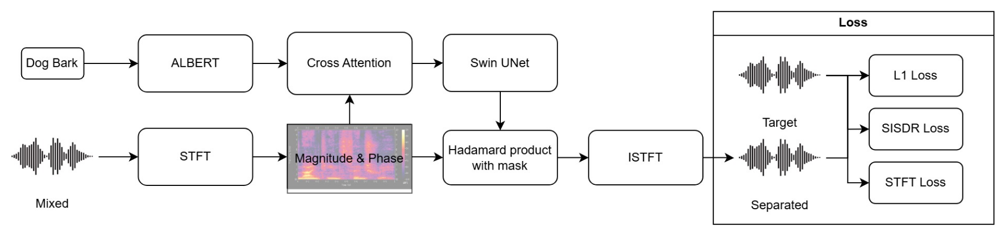

# Query Anything with SwinUnet
本專案參考這篇論文
[Separate Anything You Describe](https://ieeexplore.ieee.org/document/10819011/authors#authors)
並改善部分模型以及運算


## 介紹
本專案旨在使用文字查詢的方式從混和音訊中分離特定目標音訊，希望以輕量高效的方式實現，並達到Zero-shot的效果。


## 架構
其中實現步驟為，可參考下圖
1. 應用STFT提取振幅以及相位時頻圖
1. 透過 ALBERT 提取欲查詢文字的 Word Embedding
1. 將 Spectrogram 與 Word Embedding 做 Cross Attention
1. 將 Cross Attention 的輸出輸入Swin Unet 取得對應遮罩
1. 套用遮罩於 STFT Spectorgram 的振幅並應用原本的相位
1. 透過逆變換 ISTFT 傳換為分離音訊




## 資料集
目前使用兩筆資料集分別為
1. [Clotho2.0](https://www.kaggle.com/datasets/afonsolopodecarvalho/clothov21)

    Clotho is an audio captioning dataset, now reached version 2. Clotho consists of 6974 audio samples, and each audio sample has five captions (a total of 34 870 captions). Audio samples are of 15 to 30 s duration and captions are eight to 20 words long. 

2. [ESC-50](https://github.com/karolpiczak/ESC-50)

    The ESC-50 dataset is a labeled collection of 2000 environmental audio recordings suitable for benchmarking methods of environmental sound classification.


## 環境安裝
執行環境為 python 3.10
``` bash
pip -r requirements.txt
```

## 資料準備
將資料集下載並解壓縮後放到`datasets`底下，範例
```
datasets
 |___Clotho
 |    |___development
 |    |___evaluation
 |    |___validation
 |    |___clotho_captions_development.csv
 |    |___clotho_captions_evaluation.csv
 |    |___clotho_captions_validation
 |
 |___ESC-50
 |    |___audio
 |    |___meta
 ...
```


## 訓練
只需要執行
``` bash
python train.py
```
跑完的模型會自動保存於`lightning_logs`

## 測試
``` bash
python test.py
```